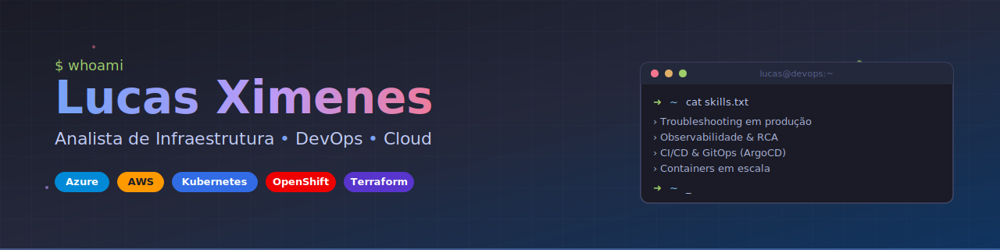

  

<h1 align="center">Olá, eu sou o Lucas Ximenes 👋</h1>
<h3 align="center">Analista de Infraestrutura • DevOps • Cloud</h3>

  
  
  <!-- TODO: trocar SEU_USUARIO_GITHUB pelo seu @ real -->
  

---

## Sobre mim

Sou Analista de Produção com **mais de 6 anos sustentando ambientes críticos de TI** — bancário, telecom e datacenter — onde _cair não é uma opção_. Minha praia é troubleshooting avançado, análise de causa raiz (RCA) e observabilidade, transformando alertas em insights e processos manuais em automação.

Hoje atuo na **Caixa Econômica Federal** (via Global Hitss) administrando ambientes com **JBoss, Kubernetes, OpenShift e Azure**, mantendo SLAs acima de **99,5%** e construindo pipelines CI/CD com Azure DevOps e ArgoCD.

- 🔧 Atualmente: **Analista de Produção Pleno** focado em automação, observabilidade e modernização de infra
- ☁️ Certificado: **Azure Administrator (AZ-104)**, **AWS Cloud Practitioner (CLF-C02)** e **Oracle Cloud Foundations**
- 🌱 Estudando: **Terraform, Kubernetes avançado e práticas SRE**
- 🧠 Curiosidade: começou com NOC, monitorando datacenter no plantão — hoje o desafio é não deixar o alerta nem chegar
- ⚡ Fun fact: já passei a madrugada caçando memory leak em JBoss enquanto o resto do mundo dormia 🌙

---

## 🛠️ Stack & Ferramentas

**Cloud**

  
  
  

**Containers & Orquestração**

  
  
  
  

**CI/CD & DevOps**

  
  
  
  
  
  

**Observabilidade**

  
  
  
  

**Servidores & Middleware**

  
  
  
  
  
  

**Linguagens & Scripting**

  
  

**Sistemas & Bancos de Dados**

  
  
  
  
  
  
  

---

## 🎯 O que faço de melhor

- 🔥 **Troubleshooting em produção** — análise de causa raiz em ambientes complexos (JBoss, WebLogic, Kubernetes, OpenShift), com histórico comprovado de redução de incidentes recorrentes
- 📊 **Observabilidade ponta a ponta** — dashboards Grafana, métricas Prometheus, alertas proativos no Application Insights e CA Introscope
- ⚙️ **Automação que elimina trabalho manual** — Python, Shell Script e Control-M para deploys, rotinas e jobs batch
- 🚀 **CI/CD e GitOps** — pipelines em Azure DevOps, GitHub e GitLab, com deploy declarativo via ArgoCD
- 🐳 **Operação de containers em escala** — Kubernetes e OpenShift via `kubectl` e `oc` para deploy, scaling e debug de pods
- ☁️ **Cloud Azure na prática** — AKS, App Services, Functions, Service Bus, Private Endpoints, VNETs e Monitor

---

## 🏅 Certificações

  
  
  
  

**Cursos & Trilhas**

- FullCycle: Docker, Kubernetes, Terraform, Git/GitHub
- Udemy: Prometheus do Zero ao Avançado
- AWS Educate: Cloud 101, Storage & Compute
- TFTEC Cloud: AZ-104 Prep

---

## 📊 Estatísticas do GitHub

  <!-- TODO: trocar SEU_USUARIO_GITHUB nas duas linhas abaixo -->
  
  &nbsp;
  

  <!-- TODO: trocar SEU_USUARIO_GITHUB -->
  

---

  <i>"Se está em produção, eu sustento. Se cai, eu levanto. Se dá pra automatizar, eu automatizo." 🚀</i>

